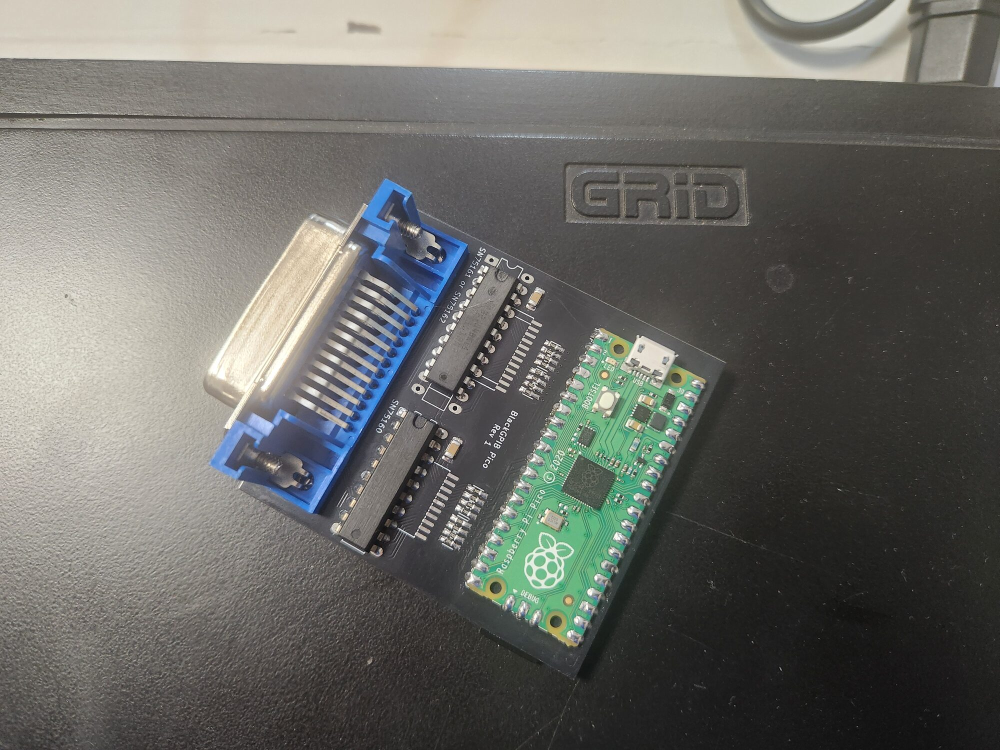

# BlackGPIB

BlackGPIB is hardware that emulates GPIB disk drives for the GRiD Compass. It is based on the Raspberry Pi RP2040.



## Hardware

Hardware schematics and design files are located in the `hardware` folder. Production files are available in the [latest release](github.com/vklachkov/blackgpib/releases) on GitHub.

We recommend using the latest `pico` version. The list of components and known issues is described in the `README.md` file located in the `hardware/pico` directory.

## Firmware

The firmware source code is located in the `pico` folder.

The latest stable prebuilt firmware in UF2 format is available in the [latest release](https://github.com/vklachkov/blackgpib/releases) on GitHub.

### Flashing prebuilt firmware

To flash the firmware, hold the **BOOTSEL** button while connecting the Raspberry Pi Pico to your computer. The Pico will appear as a removable drive.

Copy the `blackgpib.uf2` file to this drive. The Pico will reboot automatically after the file is copied.

### Building firmware from source

To build the firmware yourself, install the Pico SDK first. Follow the instructions on the official Raspberry Pi website:

https://www.raspberrypi.com/documentation/microcontrollers/c_sdk.html

Then follow these steps.

1. Clone the repository:

```bash
git clone --depth 1 --recursive https://github.com/vklachkov/blackgpib
```

2. Go to the sources directory:

```bash
cd blackgpib/pico
```

3. Configure the project for your board:

```bash
cmake -S . -B build -DPICO_BOARD=pico
```

4. Build:

```bash
cmake --build build -j
```

5. Flash the firmware:

   Hold the **BOOTSEL** button while connecting the Raspberry Pi Pico to your computer. Then copy the `blackgpib.uf2` file from the `build` folder to the mounted Pico drive.

## How to use it?

After assembling and flashing the device, find a microSD card and format it as FAT32 or exFAT. Copy the disk images to this card. Insert the microSD card into BlackGPIB. Connect BlackGPIB to power, the LED should turn on after about one and a half seconds. After that, you can turn on the GRiD Compass. Enjoy!

### Which file formats are supported?

Currently, only .IMG files are supported. IMD and .CHD are not supported.

If you want to use IMD files from gridrepository.org, please use the [imd2raw](https://github.com/RetroFloppy/imd2raw) converter until BlackGPIB support is not available.

### How is the address selected?

For images that do not have a GPIB address specified in their filename, the address is selected automatically.

Floppy disk images use addresses 5, 6, and 13. Other images use the remaining default addresses (4, 5, 6, 12, 13).

If addresses conflict, or if there are no addresses left, an entry about this will be written to log.txt.

### How do I bind an image to a specific GPIB address?

Rename the image to FXX or HXX, where XX is the GPIB address. For example, FLOPPY4_TEST.IMG or HD12.IMG.

### How do I change the image geometry?

You can’t, it is selected automatically. Geometry configuration is not supported.

### Troubleshooting

**The LED is always off**

Check that you assembled the emulator correctly, powered it, and flashed the correct firmware.

**The device is steadily blinking the LED on the board**

This means that the device does not see the SD card, or the filesystem on it is not FAT.

Remove the SD card, format it again, and insert it into the device. If you did not disconnect power from BlackGPIB, then, if successful, the device will blink the LED several times, and then the LED should stay steadily on. This means that the device is ready to use.

**The device is blinking SOS**

This means that the device has gone into a boot loop. Normally, this should not happen.

Connect the device to your computer, open a serial port monitor, and check what went wrong before the boot loop. You can email me or open an issue, and I will try to help.

## License

This project is released under the [MIT License](LICENSE).

You are free to use, modify, and share it. I will be happy if BlackGPIB helps you bring your GRiD Compass back to life and use it again.
