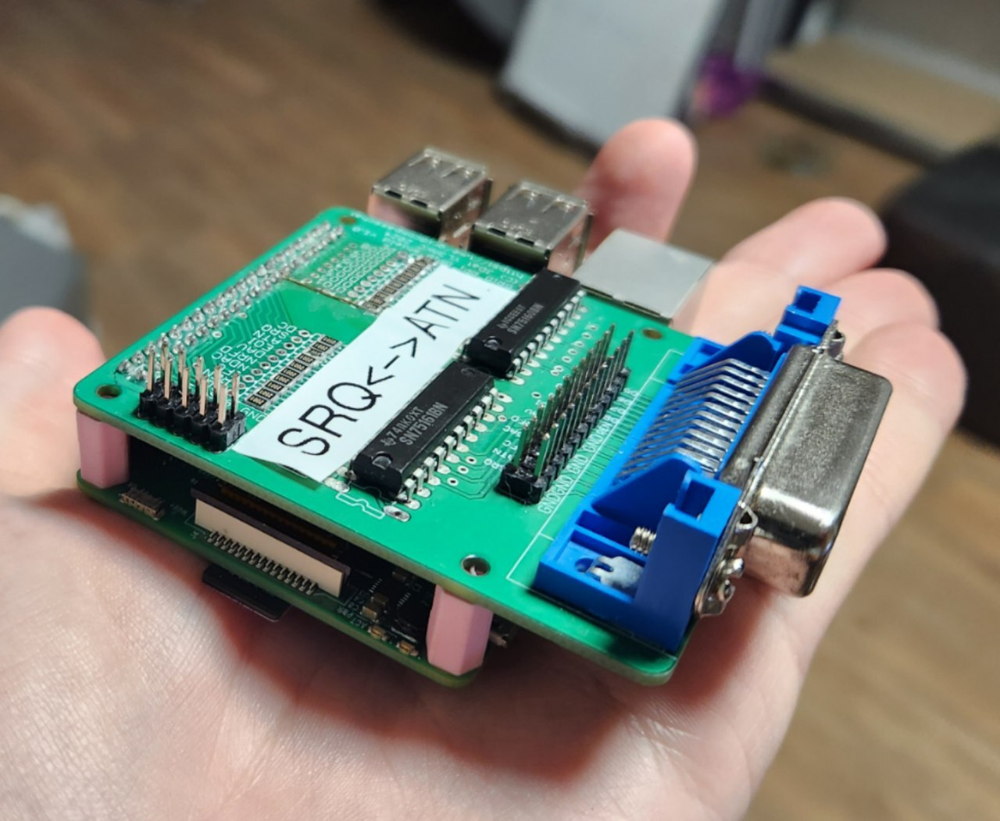

# BlackGPiB

This is a project to emulate GPiB peripherals for the [GRiD Compass](https://en.wikipedia.org/wiki/Grid_Compass) computer.

## Features

BlackGPiB can emulate a hard drive and a floppy drive. It also has a printer and plotter proxy. Current version is based on Raspberry Pi 2 or newer.

A new version for Raspberry Pi Pico is already in development.

For more information about device emulation, see the [Details About Emulation](#details-about-emulation) section.

## Photos




## How to Assemble

There is no illustrated guide, and there won't be one until a new version of the board is developed. If you are interested in assembling a prototype, you can find the board project files and their description in the [`hardware/`](./hardware/) folder.

## How to Build Software

To build the project, you need to install the latest [Rust](https://rust-lang.org/) compiler.

Then, just run:

```
make build
```

After this, the binary file will be created at `target/aarch64-unknown-linux-gnu/release/blackgpib`.

Copy this file to your Raspberry Pi and try it.

## How to Configure the emulator

For a detailed description of how to use BlackGPiB, run the program with the `-h` option.

For better stability on the Raspberry Pi prototype, it is recommended to set up a real-time (RT) kernel. Otherwise, sometimes the emulator may stop working and the Compass will show timeout errors.

## Disk Images for Emulator

The disks with the operating system and instructions for making your own disks are in the [`disks/`](./disks/) folder.

## Details About Emulation

> [!WARNING]
> The project is in active development. The emulator is not 100% compatible with real devices yet.

### Block Devices

The GRiD Compass does not see any difference between a floppy drive and a hard disk. For the computer, both are just "block devices".

BlackGPiB can emulate disks for reading and writing at all standard addresses: 4, 5, 6, 12, and 13. Disks at non-standard addresses are not supported (for now).

Other requests, except reading and writing, are not supported. You cannot format or initialize the virtual disk. Because of this, there may be problems when loading MS-DOS 2.0. Issues: https://github.com/vklachkov/blackgpib/issues/1 and https://github.com/vklachkov/blackgpib/issues/2.

### Printer and Plotter

BlackGPiB can emulate a printer and a plotter. It connects to the right addresses and sends everything from the laptop as UDP broadcast to `49275` for printer and `49276` for plotter.

A proxy for CUPS or any other system is not part of this project and will not be added to this repository.

You can make your own proxy if you like:

🖨️ For the printer proxy, we recommend using the Epson MX-82 driver and making your own converter for ESC/P commands.

🖊️ For the plotter proxy, you need to make a converter from HP-GL (not HP-GL/2) to something else. The commands from the laptop may be different from the standard, so please use documentation for supported plotters.

## Authors

This project would not have been possible without a whole group of amazing people.

Huge thanks to Kirill [@BOOtak](https://github.com/bootak) for first telling me about this laptop, reverse-engineering the file system, and providing support throughout the entire project.

Many thanks to Anton [@usernameak](https://github.com/usernameak) for the GRiD Compass emulator in MAME and for carrying out the main work on reversing the communication protocol between the laptop and peripherals.

Big thanks to [@JDat](https://github.com/JDat) for reverse-engineering the GRiD Compass, making the first version of the board, and providing a huge amount of advice during the project.

Special thanks to Kirill from the Belgrade hackerspace [Xecut](https://xecut.me/en) for his help, for providing equipment, reviewing the project, and overall participation.

And many thanks to Vladislav [@Bs0Dd](https://github.com/Bs0Dd) for the graphical interface for working with the disks — it made things much easier.
