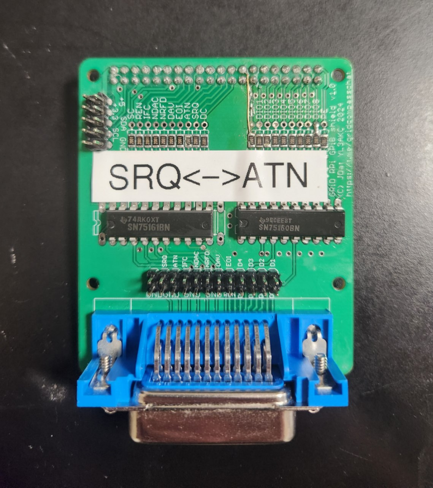
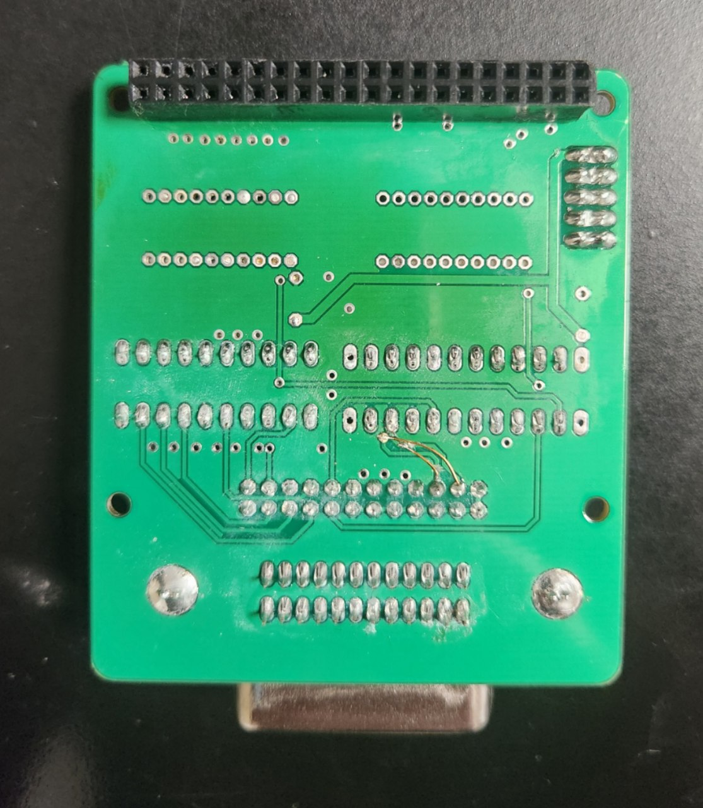

# First board by @JDat for Raspberry Pi 2+

This is the first revision of the board, designed by @JDat (also known as @YL3AKC):

> [!WARNING]
> It is better to wait for the second revision or new Pico base version. This board is still experimental.

## Components

| Part           | Value                | Package    | Quantity |
|----------------|----------------------|------------|----------|
| GPIB Connector | -                    | 90 Degree  | 1        |
| SN75160B       | -                    | SMD or DIP | 1        |
| SN75161B       | -                    | SMD or DIP | 1        |
| Resistor       | 2kΩ                  | 0805       | 20       |
| Capacitor      | 0.1uF                | 0805       | 2        |
| Pin Header     | 20x2 Straight Female | -          | 1        |

P.S. Instead of small SMD components, you can also use through-hole components, as Kirill @BOOtak Leyfer did.

https://t.me/bootaks_old_devices/286

## Errata

### ATN <-> SRQ

ATN and SRQ are mixed up on the board. Both the labels and the pins on the connector are swapped.

For the board to work correctly, you need to cut two tracks on the back side that go to SRQ and ATN, and solder two jumpers, as shown in the photo:

