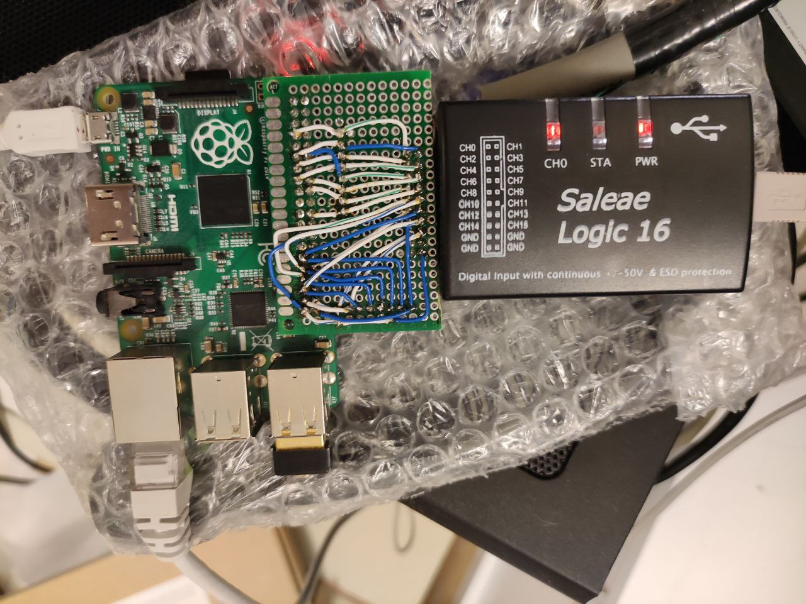

# Unfinished Version by @BOOtak

This folder contains the unfinished source code for the very first attempt to make an emulator:

The source code by Kirill Leyfer is based on the work of @usernameak for GRiD Compass emulation in MAME64:

[src/devices/bus/ieee488/grid2102.cpp](https://github.com/mamedev/mame/blob/c27c33cd833ab732b275ef04da03d1d97c42297b/src/devices/bus/ieee488/grid2102.cpp)  
[src/devices/bus/ieee488/grid2102.h](https://github.com/mamedev/mame/blob/c27c33cd833ab732b275ef04da03d1d97c42297b/src/devices/bus/ieee488/grid2102.h)

Kirill tried to debug this thing during a few YouTube streams:

https://www.youtube.com/watch?v=bkrvHpA3saQ  
https://www.youtube.com/watch?v=xkkKw8rbxL4  
https://www.youtube.com/watch?v=xiMl4WMsztg

Dumps and dump analyzers are saved "as is" in their folders for historical reasons.
